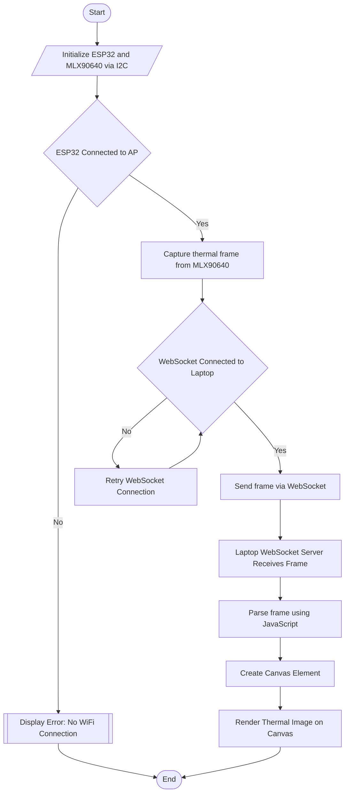

# AETHER UAV  
## Advanced Electronic Tactical Hybrid Emergency Reconnaissance Unmanned Aerial Vehicle
**This is a rapid prototype of the outcome of the proposed project.**     

---

## 📖 Introduction
AETHER UAV is a versatile multi-role drone platform built to support civil and military operations, including surveillance, rescue missions, and real-time threat assessment. Designed with modularity and adaptability in mind, it combines advanced flight systems, thermal imaging, GPS, and long-range communication to operate in hazardous environments where human intervention is difficult or risky.

---

## 🌍 Background
Bangladesh has seen a sharp rise in fire-related incidents and natural disasters in recent years. Fire incidents increased by ~50% from 2015 to 2024, with thousands of lives and properties at risk. Rapid urbanization, industrial growth, and climate challenges like flooding underscore the urgent need for a cost-effective, real-time reconnaissance and emergency response system.

---

## 🎯 Objectives
- Design and develop a modular UAV for reconnaissance, defense, and firefighting.
- Integrate thermal camera for detection and search-and-rescue.
- Support payload customization (e.g., fire retardant dispensers, beacon droppers).
- Implement real-time thermal and visual feed, GPS navigation, and air quality monitoring.
- Demonstrate practical applications of embedded systems and mechatronics in real-world emergency and defense scenarios.

---

## 🛠️ Project Description

### 🔧 System Architecture

- **Frame**: Modular carbon fiber, foldable for portability.
- **Motors**: VELOX V2812 925KV BLDC for high-efficiency propulsion.
- **Flight Controller**: GEPRC F722 for PID tuning and GPS-based navigation.
- **Camera**: Walksnail 4K for real-time FPV monitoring.
- **Thermal Sensor**: MLX90640 for fire detection and locating survivors.
- **mmWave Radar**: Seeed Studio 24GHz for presence detection in low-visibility.
- **Communication**: 
  - 5.8 GHz digital FPV video system.
  - 2.4 GHz ELRS for telemetry/control.
  - LoRa for location beacon communication.
- **Power**: 6S LiPo battery (2200–5000mAh).
- **Environmental Sensors**: Smoke (MQ02), Carbon Monoxide (MQ09).
- **Navigation**: Foxeer M10Q GPS with autonomous waypoint support.

#### Drone Base Hardware Schematic

---

### 📡 Beacon Transmitter

An independent long-endurance module with:
- GPS (Ublox Neo6M)
- LoRa SX1278 transceiver
- Active buzzer and bright LED for visibility and sound
- Long standby time for disaster zones

---

## 📦 Components & Modules

| Component              | Model / Spec                    | Purpose                                  |
|------------------------|----------------------------------|------------------------------------------|
| Flight Controller      | GEPRC F722                      | Flight control and sensor data processing|
| Motors                 | VELOX V2812 925KV              | Propulsion and maneuvering               |
| ESC                    | 50A 4-in-1                      | Power regulation and motor control       |
| Frame                 | Modular Carbon Fiber            | Structural support                       |
| Battery                | 6S LiPo (2200–5000mAh)         | Power supply                             |
| Thermal Sensor         | MLX90640                       | Fire detection and heat mapping          |
| Camera System          | Walksnail Avatar 4K            | Visual monitoring and FPV                |
| Radar Sensor           | Seeed Studio XIAO 24GHz        | Human presence detection                 |
| GPS                    | Foxeer M10Q                    | Navigation                               |
| Remote System          | Radiomaster RP3 v2 ELRS        | Low-latency telemetry & control          |
| Microcontroller        | ESP32 Dev Kit                  | Sensor processing                        |
| Buzzer                 | 5V Active Buzzer               | Rescue alert                             |
| LoRa Module            | SX1278                         | Location beacon transmission             |
| Environmental Sensors  | MQ02, MQ09                     | Smoke & CO detection                     |

---
# 🕹 Integrations
## Thermal Camera Visualization to Dashboard
The MLX90640 Thermal Camera is a 32x42 Thermal camera module, which can use I2C to transfer thermal image frames. 
It can support up to 32Hz frame rate. But due to ESP32's low processing power, we will not overload it and keep it to 8Hz. These frames are sent to a websocket server in the base station via a wireless access point link. After being broadcast, the data gets parsed to the dashboard by JavaScript Websocket API and a Custom JavaScript code to generate a Thermal Visualizer to provide better human interaction with the thermal camera data. 

Here is the complete flow chart of the thermal image processing. [View the Full Diagram](https://github.com/TawsifTorabi/AETHER_UAV/blob/main/docs/Flowcharts/ThermalCameraFlowchart.svg)

---

## 🧰 Tools & Technologies

### Hardware
- VELOX V2812 Motors  
- GEPRC TAKER F722 FC  
- SpeedyBee Mario 8-Fold Frame  
- Walksnail Moonlight 4K FPV  
- MLX90640 Thermal Sensor  
- Foxeer GPS, Lollipop Antenna  
- Radiomaster RP3 v2 ELRS  

### Software
- **Betaflight** – Flight configuration  
- **Arduino IDE / PlatformIO** – Firmware development  
- **Python** – Thermal data visualization  
- **ExpressLRS Configurator** – Radio setup  
- **JavaScript** – UI for dashboard  

### Communication & Protocols
- **ExpressLRS (2.4GHz)** – RC link  
- **5.8GHz FPV** – Live video transmission  
- **LoRa (SX1278)** – Beacon telemetry  
- **WebSocket** – Thermal image transmission  
- **I²C / UART / PWM** – Sensor interfacing and motor control  

---

## 📌 Future Improvements
- Payload delivery mechanism

---

## 📍 Conclusion
AETHER UAV represents a compact, modular, and mission-adaptable unmanned system engineered to support both civil safety operations and tactical missions. With real-time surveillance, thermal imaging, environmental sensing, and long-range control, it serves as a cost-effective response tool for modern emergencies in densely populated and disaster-prone regions.

---
